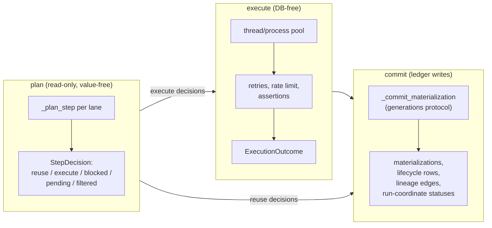

# The Model

Rubedo runs a DAG of Python steps over a keyed collection of items and gives
you dbt-style state for it: every output lands at a deterministic address,
an append-only ledger records what happened to every item in every run, and
lineage edges connect each output to the outputs it was derived from.
Nothing here is magic — it's a hash function, a commit rule, and a log. This
page is the vocabulary; [`../notes/invariants.md`](../notes/invariants.md) is
the canonical source if the two ever disagree.

## Lanes

A **lane** is the unit the engine schedules work over — one row, one file,
one joined pair, one expanded child. Every lane has a **coordinate** (a lane
key): the engine's dataflow key. Within a run it matches a step's output to
its consumers; across runs it decides "is this the same item as last time."

A coordinate is **content-addressed by default** — `row-<hash>`, where the
hash is over the item's content. That single design choice buys you a lot,
covered in full in [sources.md](sources.md): identical items collapse to one
lane, and an edited item reads as *removed + added* rather than *changed in
place*.

!!! note "What a coordinate is not"
    A coordinate is **not the identity of work** — that's the
    content-addressed **output address** (below), computed from the step
    too, not just the item. And it's **not the primary search handle** —
    that's `@step(index=[...])`. A coordinate is always `row-<hash>`, never
    a file name or a row id, so nothing downstream can treat it as one.
    Query by what a step *computed* (`index=`), not by coordinate.

A coordinate can also be **minted mid-DAG**: `expand` mints a fresh
content-addressed `row-<hash>` lane per yielded payload, and `join` mints an
`a|b|…` pair-lane by joining its matched parents' coordinates with `|`. See
[shapes.md](shapes.md).

## Output addresses

Every step's output is stored at a **deterministic address**:

```
hash(step, version, input_hash[, params_hash][, code_hash])
```

Concretely (`hashing.compute_output_address`): `step`, `version`, and
`input_hash` are always in; `params_hash` is appended only for steps that
declare a `params` argument, and `code_hash` only for `code="auto"` steps.
Each optional segment is labeled so its presence or absence can't collide
with another combination. The whole thing is SHA-256'd. This is what makes
caching **order-independent and rerun-safe**: the address doesn't care when
you ran, only *what* you'd be computing — so two different execution orders
(`schedule="broad"` vs `"deep"`, see
[../guides/execution-policies.md](../guides/execution-policies.md)) always
converge on identical ledger rows.

## Two inputs, two cache-key slots

A step consumes up to two independent things, and each gets its own slot in
the address:

- **data** — the source payload for a root step, or the parent output(s) for
  a dependent step. Always hashed into `input_hash`.
- **params** — run-level knobs, validated against the pipeline's
  `params_model` if one is declared. Hashed into `params_hash` *only* for
  steps whose function signature actually accepts a `params` argument — a
  step that never reads a knob never recomputes when it changes.

Turning a knob recomputes exactly the steps that read it, and nothing else.
`code_hash` is a third, opt-in slot — see [versioning.md](versioning.md).

## The ledger

The ledger is **append-only**, enforced at the ORM layer (`models.py`
raises `ImmutabilityError` on update/delete for ledger tables). It records:

- **Runs** — a user-triggered execution attempt over some scope. Status is
  terminal-only (`completed` / `completed_with_failures` / `failed`); a run
  in flight has no stored "running" state — readers derive that from a
  heartbeat, because a durable "running" row could outlive a killed process
  and lie forever.
- **Run events** — every attempt, successful or not, including retries.
- **Run-coordinate statuses** — the relationship between a run and a
  coordinate at a step: `created`, `reused`, `failed`, `blocked`, `filtered`.
- **Materializations** — successful, committed outputs. Immutable once
  written.
- **Materialization lifecycle rows** — the append-only truth behind every
  liveness/freshness transition (`created` / `reused` / `restored` /
  `superseded` / `refreshed` / `invalidated` / `pruned`). `is_live` and
  `refreshed_at` on `Materialization` are just mutable *projections* of this
  log — a commit-time session guard rejects any flip that doesn't ship a
  paired lifecycle row in the same transaction (see
  [`../notes/invariants.md`](../notes/invariants.md)).
- **Materialization edges** — lineage: which output(s) a given output was
  derived from. This is what `trace()` walks.

## Materializations and generations

An output address can accumulate **generations** over time, but at most one
is ever live. When a step re-executes and produces bytes, `_commit_materialization`
applies one rule set:

- **Identical bytes, address currently live** → `reused`: the existing row
  stands, nothing new is written.
- **Identical bytes, address currently non-live** (a past generation matches
  again) → `restored`: that old row's liveness flips back on, with a
  `restored` lifecycle row — no new bytes.
- **Different bytes** → `superseded`: the live generation is demoted
  (`is_live=False`, paired `superseded` lifecycle row, flushed *before* the
  replacement inserts, so the one-live-per-address constraint never sees two
  live rows at once) and the new bytes become the live generation.
- **A `stale_after` re-verification that lands on identical bytes** →
  `refreshed`: the clock resets without changing which bytes are live.

This is the mechanism behind "different bytes supersede, identical bytes
reuse or restore" — it's what lets a pipeline safely re-run non-idempotent
steps: same output, no new row; genuinely different output, a new
generation that downstream recomputes against.

## Plan → execute → commit

A run has three phases with a hard boundary between them:

- **Planning is read-only and value-free.** `planning.py`'s only database
  access is checking whether a computed address is already a live
  materialization. It never reads a payload's actual value (with the
  narrow, documented exception of `group_key`/`join_on`, which read
  *indexed fields* at plan time — still no value bytes). The output is a
  `StepDecision` per lane: `reuse`, `execute`, `blocked`, `pending`, or
  `filtered`.
- **Execution is DB-free.** `execution.py` runs step functions in a thread
  or process pool, applies retries/rate limiting/assertions, and returns
  outcomes — it never touches the ledger.
- **Commit is the only writer.** `ledger.py` takes execution outcomes and
  applies the generations protocol above, writing every ledger row for a
  run from the main thread.



`p.plan()` runs the plan phase alone and writes nothing — a dry-run of what
`p.run()` would do and why. `p.run()` chains all three per step, feeding each
step's committed materializations forward as the next step's parent lookup.
See [../guides/inspecting-runs.md](../guides/inspecting-runs.md) for reading
the output of both.

## The promises, plainly

Everything above exists to keep four promises (the full guarantee-level
detail lives in [`../notes/invariants.md`](../notes/invariants.md)):

1. **Never pay twice for the same computation.** "Already done" is checked
   against the ledger, not memory — skip-if-exists is a materialization
   lookup keyed on the deterministic output address, not a runtime cache,
   and the generations protocol extends this across time so identical
   bytes always reuse or restore rather than recompute.
2. **Never lie about what happened.** No materialization row exists unless
   its output actually landed; a committed materialization never changes in
   place (fix forward with a new generation); a dying worker corrupts
   nothing committed, because execution is DB-free; users see current state
   through views, never raw storage; run status lives on the
   run–coordinate edge, not on the bytes (the same output can be `created`
   in one run and `reused` in the next); and every liveness flip ships its
   lifecycle row in the same transaction — a commit-time guard enforces
   this, so there is no code path that can flip `is_live` silently.
3. **Order and parallelism never change results.** Output addresses come
   from `step`/`version`/`input_hash`(/`params`/`code`), never from
   wall-clock order or worker assignment, so `schedule="broad"` vs
   `"deep"` and `executor="thread"` vs `"process"` always converge on
   identical ledger rows.
4. **Bytes are disposable, facts are not.** Invalidation and retention
   delete facts never, bytes sometimes: retention GC (see
   [../guides/retention.md](../guides/retention.md)) demotes and eventually
   deletes *object bytes*, but the ledger row, the lineage, and the record
   of the deletion itself (`object_reclamations`) all survive forever.

## Where to go next

- [shapes.md](shapes.md) — the four ways a step turns lanes into lanes.
- [sources.md](sources.md) — where lanes come from.
- [versioning.md](versioning.md) — how code changes interact with all of the
  above.
- [../guides/search-and-invalidation.md](../guides/search-and-invalidation.md)
  and [../guides/inspecting-runs.md](../guides/inspecting-runs.md) — using
  this model day to day.
