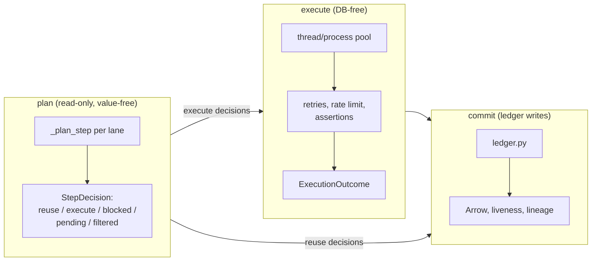

# How it works

You write steps. Rubedo stores every result at a deterministic address and,
on the next run, recomputes only what changed. Nothing here is magic — a
hash function, a commit rule, and a log. The guarantees are in the
[invariants](../development/invariants.md).

## Lanes

A **lane** is the unit of work — one row, one file, one joined pair, one
expanded child. Its **coordinate** is the dataflow key: within a run it
matches a step's output to its consumers; across runs it decides "is this
the same item as last time."

Coordinates are **content-addressed** by default (`row-<hash>` over the
item's content). Identical items collapse to one lane. An edited item
reads as *removed + added*, not *changed in place* — so incrementality
survives reordering, dedup, and appends.

A coordinate is **not** the identity of work (that's the output address
below) and **not** the search handle (that's the output struct's fields).
Query by what a step *computed*. Special coordinates: `@root` (map root),
`@all` (ungrouped aggregate), `a|b|…` (join pairs).

## Output addresses

Every result lives at:

```
hash(step, version, input_hash[, params_hash][, code_hash], pipeline)
```

`step`, `version`, and `input_hash` are always in; `params_hash` only if
the function takes `params`; `code_hash` only for `code="auto"`;
`pipeline` is always last and required. Two pipelines with an identically
named step never share a cache entry. The address does not care *when* you
ran, only *what* you'd be computing — so `schedule="broad"` vs `"deep"`
and thread vs process vs an external pool always converge on the same
rows.

A step has two cache-key slots: **data** (always hashed into
`input_hash`) and **params** (hashed only for steps that declare `params`).
Turning a knob recomputes exactly the steps that read it.

## When code changes

Two independent axes on `@step`:

- **`version`** — you bump it for a deliberate behavior change (or an
  edit the engine can't see, like a helper the step calls). Default `"0"`.
- **`code`** — what a *source* edit means. `code="auto"` folds the
  function's source into the cache key (right for cheap deterministic
  steps). `code="warn"` (default) never recomputes on edits, but warns
  loudly when reused code has drifted — so recomputing an LLM step stays
  a deliberate choice.

`stale_after="24h"` is a wall-clock TTL, independent of both: past it the
step re-runs; identical bytes refresh the clock, different bytes supersede
and downstream recomputes.

`skip_cache=True` marks a cheap, deterministic helper that is never
materialized — its identity fuses into its consumers. Don't skip anything
expensive, flaky, or non-deterministic. Full rules for `version` / `code` /
TTL / skip: [When code changes](versioning.md).

## Shapes

Most of the time you don't pass `shape=` — it's inferred. A generator is
`expand`, `join_on=` is `join`, `group_key=` is `aggregate`, anything else
is `map`. An explicit value that contradicts the code raises.

| Shape | In → out | When |
|---|---|---|
| `map` | 1:1 | Almost every transform. A parentless non-generator is a **source-less root**: one `@root` lane whose input is its params. |
| `expand` | 1:N | The step `yield`s payloads; each becomes a `row-<hash>` child. A parentless generator is a **source**. |
| `aggregate` | N:1 | Fan-in over surviving parent lanes (`@all`), or `group_key="field"` for one output per field value. |
| `fold` | N:1 | Like aggregate, but an accumulator (`fold_init`) plus one parent value at a time. |
| `join` | N-way | Equijoin on `join_on={parent: field}`, minting `a\|b\|…` pair lanes. `join_mode="intersect"` (inner, default) or `"union"` (symmetric outer; absences are `None`). Anti-join = union, then `Filtered`. |

**Broadcast.** A source-less root (or an ungrouped aggregate) can be named
alongside a real per-row dependency — every row sees the same value. Two
*real* multi-lane parents that don't share a coordinate lineage still
error; that's what `join` is for.

The traps, caching stories, and `p.join(...)` live in the
[shape reference](shapes.md). Inner vs outer vs anti-join:
[Enrich and join tables](../guides/data-enrichment.md).

## Sources

A source is a step that yields items — not a class. `check_cache=False`
on a source that watches the outside world (folder, CSV, table), so it
re-enumerates every run. Without that, the fan-out is cached and new files
don't show up.

```python
# folder — one lane per file (read the bytes, not just the path)
@p.step(check_cache=False)
def scan():
    for name in sorted(os.listdir("input")):
        path = os.path.join("input", name)
        if os.path.isfile(path):
            yield {"path": name, "text": open(path).read()}

# CSV — one lane per row
@p.step(check_cache=False)
def leads():
    with open("data/leads.csv", newline="") as f:
        yield from csv.DictReader(f)

# SQL — one lane per row
@p.step(check_cache=False)
def orders():
    with engine.connect() as conn:
        for row in conn.execute(text("SELECT * FROM orders")).mappings():
            yield dict(row)
```

Cloud object storage: LIST only in the source (yield `key`/`etag`/`size`);
a cached downstream step does the GetObject. Recipes, including that
pattern: [Sources](sources.md).

## The ledger

Append-only SQLite (control plane) + append-only Arrow IPC files (data
plane, `.rubedo/tables/`). It records runs (terminal status only — in-flight
is a heartbeat), events, per-lane statuses (`created` / `reused` /
`failed` / `blocked` / `filtered`), lineage edges, and
`input_hash_usages` — the liveness gate (`fulfilled=True` means reuse).

When a step re-executes: identical bytes → `reused` (downstream skipped);
different bytes → `created` (downstream recomputes); a `stale_after`
re-check with identical bytes → `refreshed`.

## Plan → execute → commit


```mermaid
flowchart LR
    subgraph Plan["plan (read-only, value-free)"]
        P1["_plan_step per lane"] --> P2["StepDecision:\nreuse / execute / blocked /\npending / filtered"]
    end
    subgraph Execute["execute (DB-free)"]
        E1["thread/process pool"] --> E2["retries, rate limit,\nassertions"] --> E3["ExecutionOutcome"]
    end
    subgraph Commit["commit (ledger writes)"]
        C1["ledger.py"] --> C2["Arrow, liveness, lineage"]
    end
    Plan -->|execute decisions| Execute --> Commit
    Plan -->|reuse decisions| Commit
```

`p.plan()` is the plan phase alone and writes nothing. `p.run()` chains
all three. Planning never reads payload values (except `group_key` /
`join_on` fields). Execution never touches the ledger. Commit is the only
writer, on the main thread.

A `check_cache=False` source always plans as `execute` (no cached
enumeration to preview); everything downstream shows `pending` until the
source actually runs. That's why `created=2` after editing one file is two
*steps* for one file, not two files.

## The four promises

1. **Never pay twice for the same computation.** Checked against the
   ledger, not memory.
2. **Never lie about what happened.** No Arrow row unless the output
   landed; rows never change in place; a dying worker corrupts nothing
   committed.
3. **Order and parallelism never change results.** Addresses don't include
   wall-clock or worker id.
4. **Bytes are disposable, facts are not.** Invalidation and retention
   delete bytes sometimes, ledger rows never.
